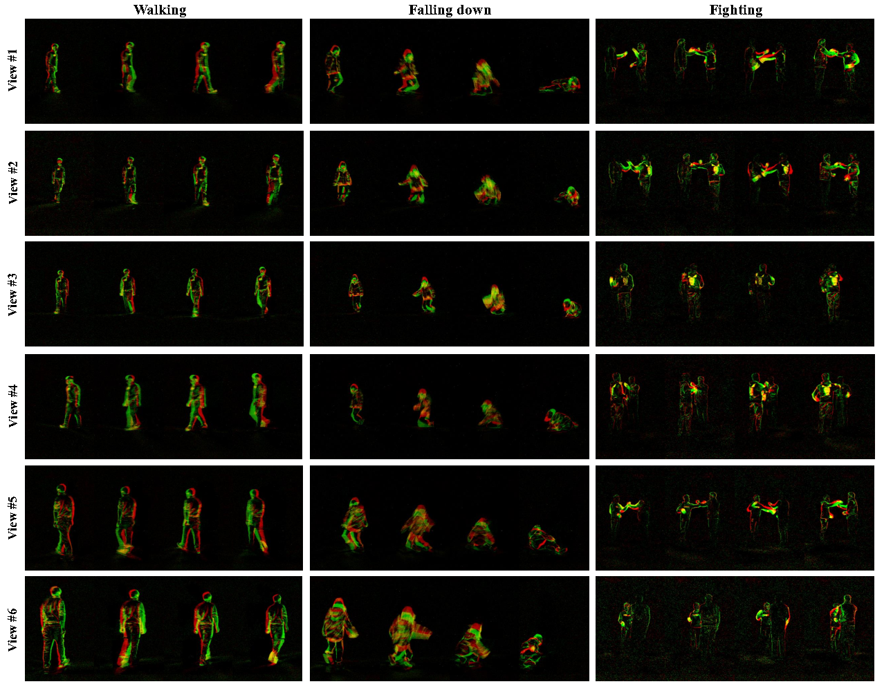
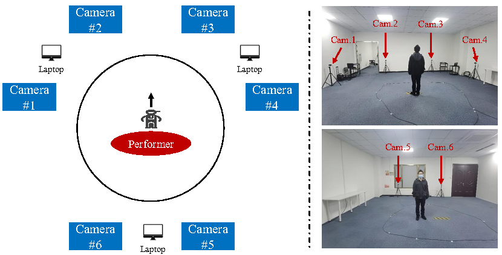

# THU<sup>MV-EACT</sup>-50: A Large-Scale Multi-View Event-Based Action Recognition Benchmark

**News Update**: The dataset is now available! You can download it from [THU<sup>MV-EACT</sup>-50](https://download.moon-lab.tech:20443/datasets/THU-MV-EACT-50.tar.gz).

Introduced by the paper, "[Hypergraph-Based Multi-View Action Recognition Using Event Cameras](https://ieeexplore.ieee.org/abstract/document/10480584/)" in TPAMI 2024, **THU<sup>MV-EACT</sup>-50** is a pioneering large-scale multi-view dataset for event-based action recognition, aiming to fulfill the gap in existing datasets which are often limited in action categories, data scale, and lack complexity for practical applications. The dataset is an extension of the single-view [**THU<sup>E-ACT</sup>-50**](https://github.com/lujiaxuan0520/THU-EACT-50),  providing a multi-view benchmark that enhances the dataset's applicability in real-world scenarios.



## Dataset Overview

THU<sup>MV-EACT</sup>-50 stands out as the first multi-view dataset specifically designed for the event-based action recognition task. It incorporates the same 50 action categories as its predecessor, THU<sup>E-ACT</sup>-50, but extends the content to include 31,500 video recordings from **6** distinct viewpoints, offering a resolution of 1280x800. 

The dataset was collected in an indoor venue approximately 100m² using CeleX-V cameras arranged to capture 6 viewpoints (4 frontal and 2 backward) of the action performer. The setup ensures comprehensive coverage of each action from multiple angles, enhancing the dataset's utility for multi-view action recognition tasks.



## Dataset Highlights
- **50 action categories:** Includes a broad spectrum of actions relevant to indoor health monitoring, whole-body movements, and interactions.
- **~31,500 video recordings:** Enormously expands the data available for event-based action recognition research.
- **6 viewpoints:** Captures actions from 4 frontal and 2 backward views, offering a comprehensive multi-view perspective.
- **Diverse participant demographic:** Features 105 socially recruited subjects, covering a wide age range of males and females (15-72 years).

## List of Actions

| ID | Action                  | ID | Action                  | ID | Action                  | ID | Action                  | ID | Action                                |
|-----------|-------------------------|-----------|-------------------------|-----------|-------------------------|-----------|-------------------------|-----------|---------------------------------------|
| A0        | Walking                 | A10       | Cross arms              | A20       | Calling with phone      | A30       | Fan                     | A40       | Check time                            |
| A1        | Running                 | A11       | Salute                  | A21       | Reading                 | A31       | Open umbrella           | A41       | Drink water                           |
| A2        | Jump up                 | A12       | Squat down              | A22       | Tai chi                 | A32       | Close umbrella          | A42       | Wipe face                             |
| A3        | Running in circles      | A13       | Sit down                | A23       | Swing objects           | A33       | Put on glasses          | A43       | Long jump                             |
| A4        | Falling down            | A14       | Stand up                | A24       | Throw                   | A34       | Take off glasses        | A44       | Push up                               |
| A5        | Waving one hand         | A15       | Sit and stand           | A25       | Staggering              | A35       | Pick up                 | A45       | Sit up  |
| A6        | Waving two hands        | A16       | Knead face              | A26       | Headache                | A36       | Put on bag              | A46       | Shake hands (two-players)             |
| A7        | Clap                    | A17       | Nod head                | A27       | Stomachache             | A37       | Take off bag            | A47       | Fighting (two-players)                |
| A8        | Rub hands               | A18       | Shake head              | A28       | Back pain               | A38       | Put object into bag     | A48       | Handing objects (two-players)         |
| A9        | Punch                   | A19       | Thumb up                | A29       | Vomit                   | A39       | Take object out of bag  | A49       | Lifting chairs (two-players)          |

## Evaluation Criteria

The dataset employs Top-1, Top-3, and Top-5 accuracy metrics for evaluating the performance of event-based action recognition methods. It supports both cross-subject and cross-view experimental settings to assess the generalization ability of proposed methods across different subjects and unseen viewpoints.

## Dataset Download

The dataset is now available at [THU<sup>MV-EACT</sup>-50](https://download.moon-lab.tech:20443/datasets/THU-MV-EACT-50.tar.gz).

*Note*: After decompression, the dataset will require about 1.1TB of storage space.

## Dataset Format

The event data  is provided in the .csv format, the data is structured with 5 columns as follows:

+ y: Represents the y-coordinate of the event.
+ x: Represents the x-coordinate of the event.
+ b: This is an additional brightness value provided by the CeleX-V camera. It's worth noting that for our method, this value is not utilized.
+ p: The polarity value. It contains three categories: 1, -1, and 0. In our experiments, we ignore the 0 values and consider 1 as positive polarity and -1 as negative polarity.
+ t: Represents the timestamp of the event.

### Cross-Subject

In the Cross-Subject setting, the dataset is divided in a way that ensures the subjects in the training, validation, and test sets are mutually exclusive.

- **Training set:** Comprises 85 subjects, representing 80% of the total subjects. 
- **Validation set:** Consists of 10 subjects, which is 10% of the subjects.
- **Test set:** Also includes 10 subjects, equating to the remaining 10% of participants..

The data for each set is provided in specific pickle files, named accordingly:

- `train_all_views.pkl` for the training set
- `val_all_views.pkl` for the validation set
- `test_all_views.pkl` for the test set

### Cross-View

The Cross-View setting addresses a different aspect of generalizability: the model's ability to recognize actions from unseen viewpoints. The dataset division for Cross-View experiments is as follows:

- **Training set:**  Uses data from 4 specific views (View #0, #1, #2, and #4).
- **Validation set:** Solely comprises View #3.
- **Test set:** Solely comprises View #5.

For the Cross-View experimental setup, the respective pickle files are named:

- `train_cross_views.pkl` for training data across the selected views
- `val_cross_views.pkl` for validation data from View #3
- `test_cross_views.pkl` for test data from View #5

The preprocessing operations for the 2 modes can be found in `dataset.py`.

## Acknowledgements

We would like to express our sincere gratitude to Tsinghua University, partner companies, and organizations for their invaluable support and collaboration in making this dataset possible. Additionally, we extend our thanks to all the volunteers who participated in the data collection process. Their contributions have been instrumental in the development and evaluation of this benchmark.

## License

This dataset is licensed under the MIT License.

## Citing Our Work

If you find this dataset beneficial for your research, please cite our works:

```bibtex
@article{gao2024hypergraph,
  title={Hypergraph-Based Multi-View Action Recognition Using Event Cameras},
  author={Gao, Yue and Lu, Jiaxuan and Li, Siqi and Li, Yipeng and Du, Shaoyi},
  journal={IEEE Transactions on Pattern Analysis and Machine Intelligence},
  year={2024},
  volume={46},
  number={10},
  pages={6610-6622},
  publisher={IEEE}
}

@article{gao2023action,
  title={Action Recognition and Benchmark Using Event Cameras},
  author={Gao, Yue and Lu, Jiaxuan and Li, Siqi and Ma, Nan and Du, Shaoyi and Li, Yipeng and Dai, Qionghai},
  journal={IEEE Transactions on Pattern Analysis and Machine Intelligence},
  year={2023},
  volume={45},
  number={12},
  pages={14081-14097},
  publisher={IEEE}
}
```
